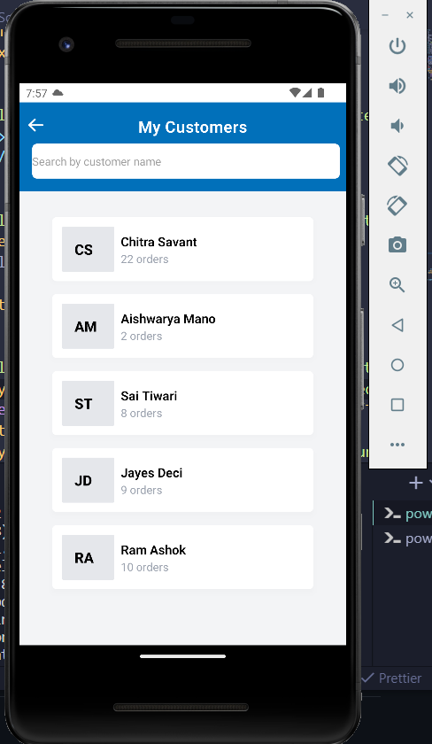
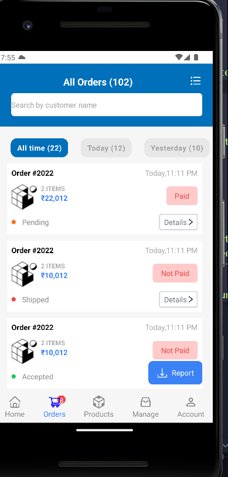
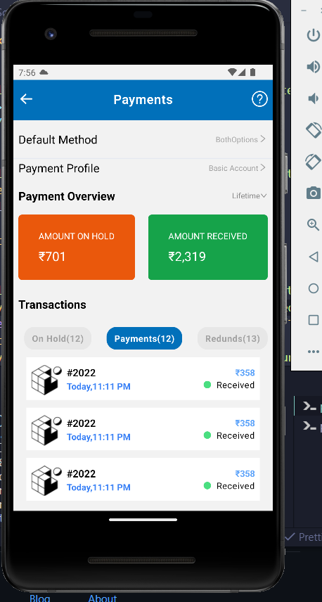
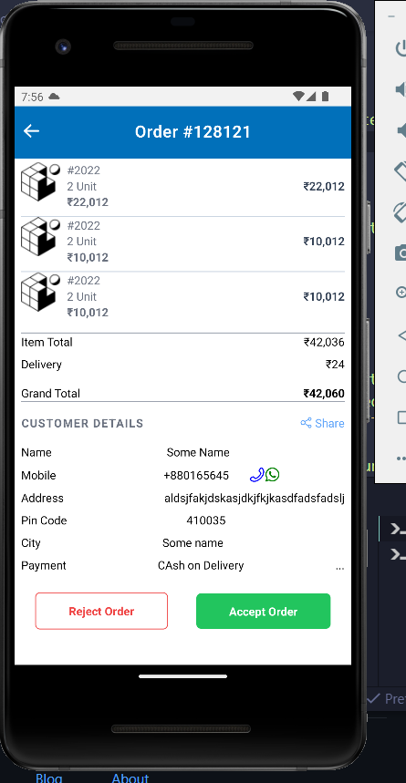
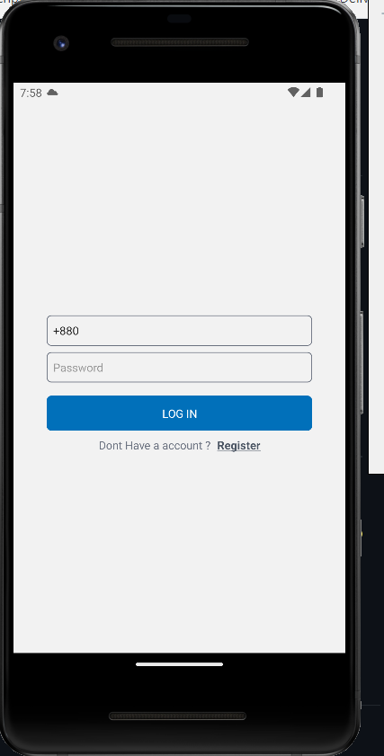

# React App For E-commerce Platform.

## Description

Designed 4 views using Tailwindcss with some third party libraries such as -

1. react-native-vector-icons
2. tailwindcss

## How to install
1. First clone the project
2. use expo install to install package.json
3. use expo start in the terminal to start the project 
4. use Expo Go as emulator to see live preview.

## ScreenShots

1. CustomerList: 
2. Manage Orders: 
3. Online Payments: 
4. Zero Commissions: 
5. Login: 

## What I Learned Building This Project

Building this project i learned JWT authorization as well as async storage and some React Native features that i did not know before.
